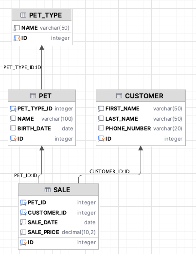

# Petshop

A simple Spring Boot REST API for managing pets in a shop. It demonstrates a clean-layered architecture with JPA entities, MapStruct mappers, validation, and a friendly error model. OpenAPI/Swagger UI is included for exploring and trying endpoints.

## Database Structure



## What it does
- Manage pets (create, read, update, delete)
- Validate request payloads with clear error messages
- Store data in an in-memory HSQLDB database initialized from SQL scripts (schema.sql, data.sql)

## Tech stack
- Java 21
- Spring Boot 3 (Web, Validation, Data JPA, Actuator)
- HSQLDB (in-memory)
- MapStruct (DTO mapping)
- springdoc-openapi (Swagger UI)

## Quick start
Prerequisites: Java 21 installed. No external database is required.

1) Run the application
- Using Gradle (recommended during development):
  ```bash
  ./gradlew bootRun
  ```
- Or build a jar and run it:
  ```bash
  ./gradlew clean build
  java -jar build/libs/petshop-0.0.1-SNAPSHOT.jar
  ```

2) Open Swagger UI
- http://localhost:8080/swagger-ui/index.html

3) Sample health check (if actuator is enabled by your profile):
- http://localhost:8080/actuator/health

## Non-standard configuration / Notes
- In-memory HSQLDB with SQL init:
  - Spring is configured to use an in-memory HSQLDB (jdbc:hsqldb:mem:mydb).
  - Hibernate DDL auto is disabled and schema/data are loaded via Spring SQL initializer (see application.properties, schema.sql, data.sql).
- Embedded HSQLDB server for IDE access:
  - A helper bean starts an HSQLDB TCP server on port 9001 at startup so IDEs (e.g., IntelliJ) can connect and inspect data while the app runs.
  - Connection details (also commented in application.properties):
    - User: `sa`
    - URL: `jdbc:hsqldb:hsql://localhost:9001/mydb`
    - Password: empty
- Ports:
  - API: 8080
  - HSQLDB server (for IDE connection): 9001

## Running tests
```bash
./gradlew test
```

## Building
```bash
./gradlew clean build
```
The build produces a runnable jar under `build/libs/`.
